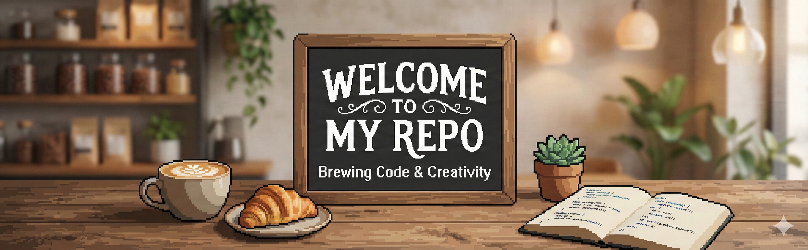
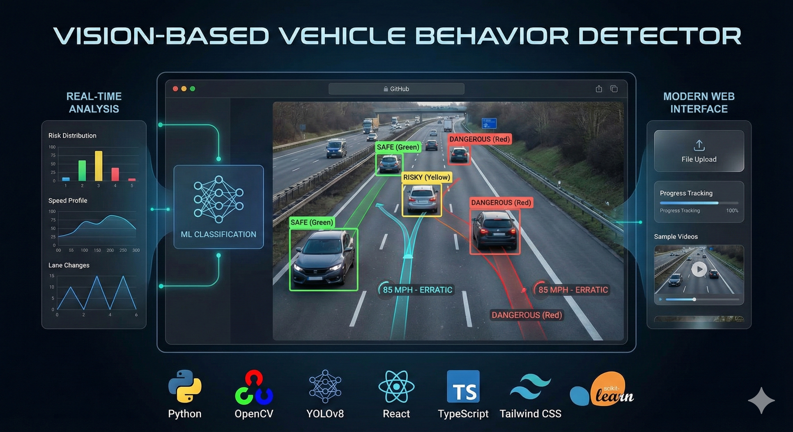
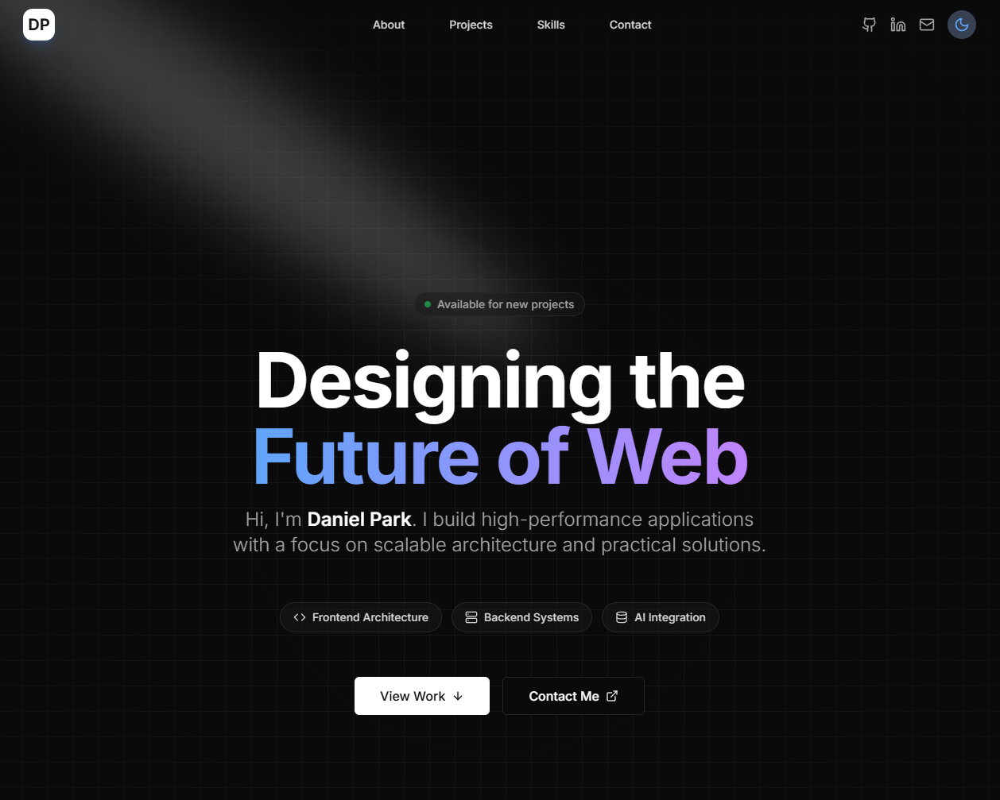

  

 

<h1 align="center">
  
</h1>

  
  &nbsp;
  
  &nbsp;
  

 

<table align="center" border="0" cellpadding="20" cellspacing="0" width="95%" style="background-color: #fffaf0; border-radius: 15px; box-shadow: 0px 4px 20px rgba(0,0,0,0.1); border: 1px solid #e0d0b0;">
  <thead>
    <tr>
      <th colspan="2" align="center">
        <h2>📜 signature_selections.md</h2>
      </th>
    </tr>
  </thead>
  <tbody>
    <tr>
      <td width="50%" align="center" valign="top" style="border-right: 1px dashed #c0b090; padding: 20px;">
        
          
        <h3>🚗 The Commuter's Combo</h3>
        
<i>"A robust blend of Computer Vision & React."</i>

        
        
      </td>
      <td width="50%" align="center" valign="top" style="padding: 20px;">
        
          
        <h3>🍰 The Chef's Portfolio</h3>
        
<i>"Plated with Next.js & Railway infrastructure."</i>

        
        
      </td>
    </tr>
  </tbody>
</table>

 

<h3 align="center">🥣 Fresh Ingredients</h3>

  

 

  <table border="0" cellspacing="0" cellpadding="0" style="background-color: #fcfcfc; border: 1px solid #ddd; border-radius: 5px;">
    <tr>
      <td align="center" style="padding: 15px; border-bottom: 2px dashed #ccc;">
        <h3>🧾 RECEIPT: Activity Log</h3>
      </td>
    </tr>
    <tr>
      <td align="center" style="padding: 10px;">
        
      </td>
    </tr>
    <tr>
      <td align="center" style="padding: 10px;">
        
      </td>
    </tr>
    <tr>
      <td align="center" style="padding: 10px; font-family: monospace; color: #666;">
        *** THANK YOU FOR VISITING ***
      </td>
    </tr>
  </table>

 

  

